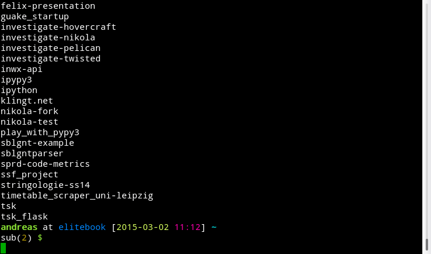

# pyv - a wrapper for virtualenv that doesn't mess around with your shell

**pyv** is an alternative to [virtualenvwrapper](https://virtualenvwrapper.readthedocs.org/en/latest/) written in bash. It works like [vex](https://pypi.python.org/pypi/vex) by starting a subshell for your virtual environment. The advantage is, that you *don't* have to *deactivate* your virtual envrionment, instead you only have leave your subshell (`Ctrl+D`) to get back where you left off.

I've tested it with `bash` and `zsh`, but it should work with other shells too.

## Dependencies

**pyv**s only dependency is [virtualenv](https://virtualenv.pypa.io/en/latest/), because it uses it to create virtual envrionments ( in the following only *pyenvs*).

## Installation

- clone the repository
- make sure you have `virtualenv` installed, if not: `pip install --user virtualenv`
- set the `WORKON_HOME` environment variable with the path to the folder where your pyenvs should be stored, g.e. `~/.virtualenvs`
    - instead of `WORKON_HOME` you can set `PYENVS`
- source the `pyv.sh` in your `bash.rc` or `zsh.rc`
- done

## Demo

recorded with [tty2gif](http://z24.github.io/tty2gif/)

## Help

- run `pyv -h`

## todo

- support virtualenvwrappers `PROJECT_HOME` and create `.project` files
